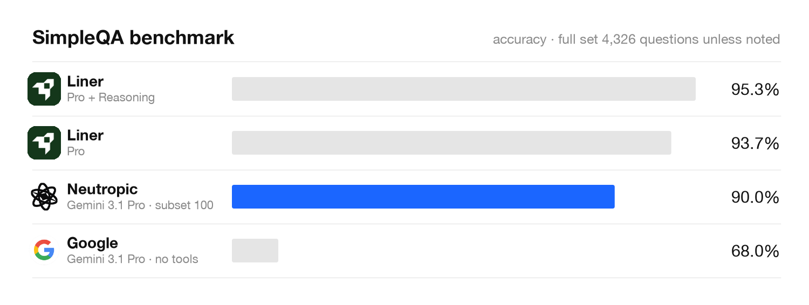
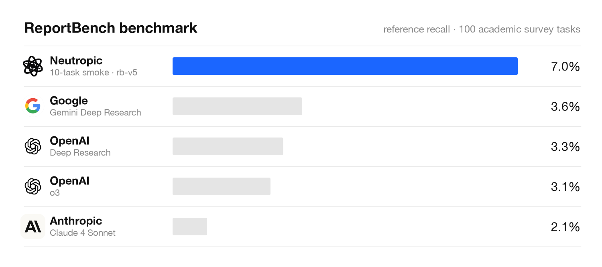
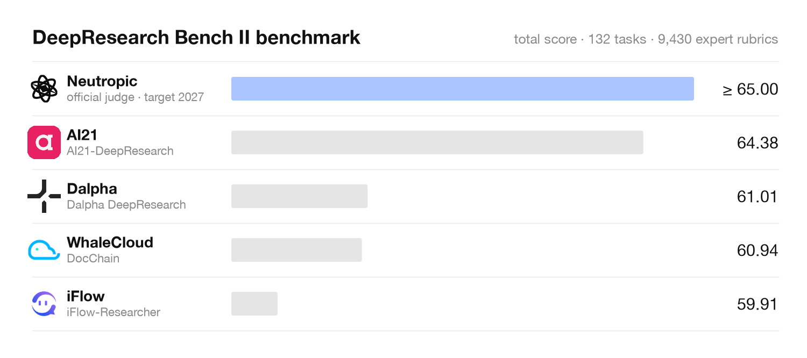
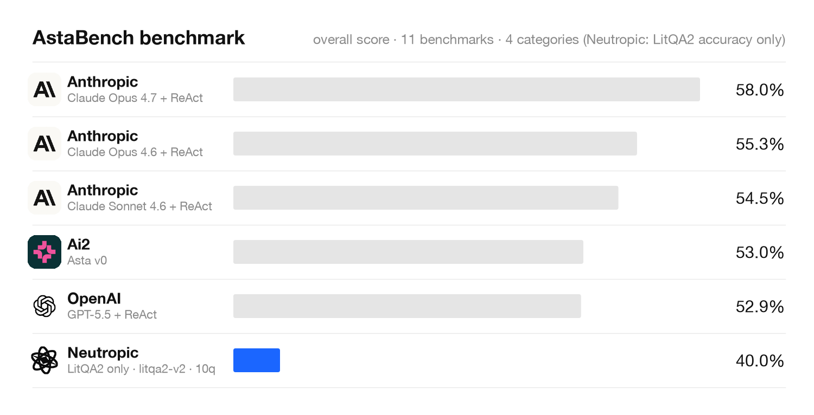

# Neutropic benchmark results

Evaluates the [Neutropic](https://neurojourney.ai) research agent — a
research agent for the human sciences (neuroscience, psychology, behavioral
science, HCI, physiological computing) — on four public benchmarks that
together track the agent's maturity from factual search to end-to-end science:

| Stage | Benchmark | What it measures | Folder |
|-------|-----------|------------------|--------|
| 01 · Search | [SimpleQA](https://github.com/openai/simple-evals) | Factual research accuracy (short-answer, 4,326 questions) | [`simpleqa/`](./simpleqa/) |
| 02 · Evidence | [ReportBench](https://github.com/ByteDance-BandAI/ReportBench) | Scientific evidence retrieval and citation faithfulness on 100 academic survey tasks | [`reportbench/`](./reportbench/) |
| 03 · Research | [DeepResearch Bench II](https://github.com/imlrz/DeepResearch-Bench-II) | Autonomous deep research — 132 tasks, 9,430 binary expert rubrics (recall / analysis / presentation) | [`deepresearch-bench-ii/`](./deepresearch-bench-ii/) |
| 04 · Science | [AstaBench](https://allenai.org/asta/bench) | End-to-end scientific agent — literature, code & execution, data analysis, discovery (2,400+ problems) | [`astabench/`](./astabench/) |

> **Status (2026-09-16):** SimpleQA has measured results on a fixed 100-question
> subset. ReportBench (five runs, rb-v1 → rb-v5 on the same 10 tasks),
> DeepResearch Bench II (dr-v1 → dr-v7 on the same 10 tasks, each also scored
> by the official GPT-5.5 judge) and AstaBench LitQA2 have **10-task smokes**
> (L1 — wiring and cost checks, not results to quote). Every "Projected" table
> is a target, not a measurement, and is replaced by measured values as runs
> land in `results/`. Next up: `dr-v8` (table-row fact hunt, entity
> enumeration) and the 100-task ReportBench run (`rb-100`).
>
> | Benchmark | Current (L1 smoke) | Best published |
> |-----------|--------------------|----------------|
> | SimpleQA | 0.90 accuracy (subset 100) | 95.3 % |
> | ReportBench | recall **0.070** · precision 0.287 · F1 0.109 (rb-v5, 10 tasks, date window + snowballing; rb-v3 0.033 / 0.182) | recall 0.036 (Gemini DR) · precision 0.385 (OpenAI DR) |
> | DeepResearch Bench II | **22.2 official GPT-5.5 judge** · 19.2 internal judge (dr-v7, 10 tasks; dr-v1 13.6 / 10.7) | 64.38 |
> | AstaBench | LitQA2 accuracy 0.30 (10 questions, 1 of 11 tasks) | overall 58.0 % |

## Notes

- Every run uses the **production Neutropic research core unchanged**. The
  benchmark adapters only normalize input/output and budgets; there is no
  benchmark-specific agent.
- Results are reported in three tiers and the tier is always stated:
  - **L1 internal** — fixed subset, one fixed grader model (Gemini), search
    cache in record/replay mode. Used for ablations and regression tracking.
  - **L2 official protocol** — full official dataset and the benchmark's own
    grader / scripts. The only tier we quote externally.
  - **L3 leaderboard** — submitted to and listed on the official leaderboard.
- Each table carries an **ablation ladder**: `model-only` (frontier model,
  no tools) → `basic-search` (web search only) → `generic-rag` (search +
  corpus, research policy off) → `full` (Neutropic). The gap between
  `basic-search` and `full` is the contribution of the agent architecture,
  independent of the foundation model.
- Cost (`$/item`) and latency (`s/item`) are reported next to accuracy for
  every row. Costs are estimates from the provider's list price at run time.
- Search-dependent benchmarks run against live academic databases and the
  open web, so scores can drift as sources change. Runs record the search
  cache so that a row can be replayed deterministically.

## SimpleQA

SimpleQA is a short-answer factuality benchmark. Answers are graded
`correct` / `incorrect` / `not attempted`; F1 rewards abstaining over
guessing. Current best published score: **95.3%** (Liner Pro + Reasoning).



### Measured — L1 internal, fixed 100-question subset

Subset: `simpleqa_subset100` (topic-stratified, deterministic sample of the
official 4,326). Generator and grader: Gemini (grader = `gemini-3.8-flash`,
thinking off). Search cache: record.

| Run | Row | n | Accuracy | Attempted | Acc. (attempted) | F1 | Tool ok | s/item (median) | tok/item | $/item |
|-----|-----|---|----------|-----------|------------------|----|---------|-----------------|----------|--------|
| [`matrix-v2`](./simpleqa/results/matrix-v2/) | `model-only` | 100 | 0.68 | 0.80 | 0.85 | 0.756 | — | 10 | 3.0k | 0.013 |
| [`matrix-v2`](./simpleqa/results/matrix-v2/) | `basic-search` | 100 | **0.94** | 0.95 | 0.99 | **0.964** | 1.00 | 42 | 26k | 0.078 |
| [`matrix-v2`](./simpleqa/results/matrix-v2/) | `generic-rag` | 100 | 0.93 | 0.96 | 0.97 | 0.949 | 1.00 | 42 | 25k | 0.072 |
| [`matrix-v2`](./simpleqa/results/matrix-v2/) | `full` (quick-fact path) | 100 | 0.89 | 0.95 | 0.94 | 0.913 | 1.00 | 24 | 31k | 0.074 |
| [`matrix-v3`](./simpleqa/results/matrix-v3/) | `full` (search cap 5, recovery hooks) | 100 | **0.90** | 0.97 | 0.93 | 0.914 | 0.95 | **22.7** | 40k | **0.067** |

Reading the table:

- Attaching search is worth **+26 pp** (0.68 → 0.94). SimpleQA is a test of
  search, so `basic-search` is effectively the ceiling; the planning /
  evidence / review layers have nothing to add here and are measured on the
  report-style benchmarks below instead.
- The remaining `full` vs `basic-search` gap (4 questions) is
  non-architectural: 4 answers guessed after search failed to confirm
  (marked `unverified`), 2 off-by-one dates, and 3 questions left unattempted
  when page fetches were blocked (all 13 tool errors in v3 were `fetch_page`
  429/blocks; recovery rate 1.00).
- `full` answers in about half the time of `basic-search` (22.7 s vs 42 s)
  because single-fact questions are routed to a lightweight `quick-fact` path.

### Projected — next runs

| Run | Tier | Scope | Target accuracy | Basis |
|-----|------|-------|-----------------|-------|
| `matrix-v4` | L1 | subset 100, `full` | ≥ 0.94 | abstain instead of guessing after failed verification; two-source cross-check for dates; fetch fallback reader |
| `official-v1` | L2 | full 4,326 + SimpleQA Verified 1,000 | ≥ 0.955 (above the current best 0.953) | official 3-way grading prompt, grader model stated |

### Configuration

| Setting | Value |
|---------|-------|
| Generator | `gemini-3.1-pro-preview` via Neutropic model routing |
| Grader | `gemini-3.8-flash`, thinking off, fixed across all rows |
| Search | Neutropic web search connectors; cache `record` (v2, v3) |
| Per-question pause | 5 s (external DB rate limiting) |
| Runner | `python -m app.benchmarks.matrix --config evals/matrix.yaml` |

## ReportBench

ReportBench builds 100 survey-writing tasks from peer-reviewed arXiv surveys
and scores the generated report against the expert authors' reference list
(reference precision / recall), checks whether each cited statement is
supported by its source (citation match), and fact-checks uncited claims.

Published reference points (ReportBench paper):

| System | Precision | Recall | Citation match | Non-cited accuracy |
|--------|-----------|--------|----------------|--------------------|
| OpenAI Deep Research | 0.385 | 0.033 | 78.9% | 95.8% |
| Gemini Deep Research | 0.145 | **0.036** | 72.9% | 92.2% |
| claude-4-sonnet | 0.337 | 0.021 | 73.7% | 92.6% |

Recall is low for every system because expert surveys cite hundreds of
papers; no published system holds precision and recall up at the same time.
That is the axis Neutropic targets.



### Measured — L1 smoke, first 10 of 100 tasks

| Run | Row | n | Precision | Recall | F1 | Citation match | Cited acc. | refs/task | s/item | $/item |
|-----|-----|---|-----------|--------|----|----------------|------------|-----------|--------|--------|
| [`rb-v1-smoke10`](./reportbench/results/rb-v1-smoke10/) | `full` | 10 | 0.116 | 0.017 | 0.028 | 0.65 | 0.82 | 22.5 | 840 | 0.34 |
| [`rb-v2-smoke10`](./reportbench/results/rb-v2-smoke10/) | `full` + Semantic Scholar key, single container | 8 of 10 | 0.155 | 0.026 | 0.042 | 0.60 | 0.80 | 22.1 | 1,255 | 0.36 |
| [`rb-v3-smoke10`](./reportbench/results/rb-v3-smoke10/) | `full` = product Deep (deep pass + reviewer wired, WS0) | 10 | 0.182 | 0.033 | 0.055 | 0.78 | 0.89 | 15.9 | 2,949 | 0.27 |
| [`rb-v4-smoke10`](./reportbench/results/rb-v4-smoke10/) | rb-v3 + WS4: per-host request gate, 600 s research budget, no figures (OpenAlex/arXiv unavailable) | 10 | 0.169 | 0.031 | 0.051 | 0.61 | 0.81 | 17.2 | **1,424** | **0.21** |
| [`rb-v5-smoke10`](./reportbench/results/rb-v5-smoke10/) | rb-v4 + WS1: prompt date window enforced, reference cap 120, 1-hop citation snowballing, OpenAlex key | 10 | **0.287** | **0.070** | **0.109** | 0.69 | 0.85 | 22.3 | 1,172 | 0.28 |

- Deterministic reference matching against the expert list (title / arXiv id / DOI); citation judgements by the Gemini grader.
- `rb-v1`: the first five tasks score P 0.13–0.25 / R 0.018–0.038 — around the published Deep Research systems — the last five near zero. Every task hit Semantic Scholar 429 and arXiv timeouts (no API key, two containers in parallel), so the CS-heavy surveys were answered from ERIC / Europe PMC results.
- `rb-v2` (same tasks, Semantic Scholar key, one container, larger HTTP budget): the three tasks that scored zero in v1 now recall 1–3 expert references each; on the 8 scored tasks P/R rose from 0.110/0.017 to 0.155/0.026. Two tasks lost their report because the eval token expired mid-task (runs now take ~21 min per task; re-auth interval lowered to 20 min). OpenAlex 429 / arXiv timeouts persist — the next lever is reference budget and citation snowballing, not more retries.
- `rb-v3` (same tasks, the `full` preset now equals the product's Deep effort and the reviewer actually runs — earlier rows never invoked it; eval token refreshed in-task): all 10 tasks scored, P/R 0.182/0.033, citation match 0.60 → 0.78 and cited-statement accuracy 0.80 → 0.89. Best single task P 0.667 / R 0.170. Four tasks scored zero: 24 % of all cited references are newer than the prompt's explicit "published before <date>" cutoff (no year filter in retrieval), off-topic/tooling references (NumPy, PRISMA) reach the bibliography, and some reports cite only 5–8 sources. Tasks take 49 min on average (one 100 min), so the next work is the date window + reference budget/snowballing (WS1) and a per-task time budget (WS4).
- `rb-v4` (same tasks, WS4 execution budget: every DB request paced per host with a circuit breaker, 600 s research budget per task, figures off): 24 min per task (−52 %), $0.21 (−22 %), reference scores unchanged within noise (P/R 0.169/0.031). The gate also exposed that OpenAlex now bills per request and its key-less daily allowance was exhausted for the whole run — every OpenAlex call was a 429 that the circuit turned into a 0 s skip — so rb-v4 (and, unknowingly, rb-v1…v3's OpenAlex misses) ran on Semantic Scholar/Crossref/PubMed/Europe PMC alone. Citation faithfulness fell (0.78 → 0.61) because the budget cuts the deep pass on long tasks. An OpenAlex API key is in place for the next runs.
- `rb-v5` (same tasks, WS1 recall work): the prompt's "published before <month year>" window is now enforced end-to-end (query filters on every DB + hard drop at collection — 0 of 290 references after the cutoff, vs 24 % in rb-v3), the reference cap is 120, and a 1-hop citation snowball adds the top 30 references/citing papers of the 5 strongest sources. Recall 0.031 → **0.070**, precision 0.169 → **0.287**, every task above zero, 20 min and $0.28 per task with OpenAlex fully available (0 × 429). Still 10 tasks under the internal judge; the 100-task run is next.

### Projected — next runs

| Run | Tier | Row | Precision | Recall | Citation match | Basis |
|-----|------|-----|-----------|--------|----------------|-------|
| `rb-v6` (2026-09) | L1, same 10 tasks | `full` + survey-style related-literature coverage (cite the wider in-window pool), DOI / arXiv id fill for every reference | ≥ 0.30 | ≥ 0.09 | ≥ 78% | rb-v5 holds 120+ in-window papers per task but each report cites only 15–33; title-variant matches are missed without ids |
| `rb-100` (2026-10) | L1 | `full` + `basic-search` on all 100 tasks | ≥ 0.30 | **≥ 0.07** | ≥ 78% | first number at the published scale (≈ 33 h, ≈ $28 + OpenAlex ≈ $8); `basic-search` gives the architecture delta |
| `rb-official` (2026 Q4 – 2027 H1) | L2 | `full` | ≥ 0.30 | ≥ 0.07 | ≥ 80% | official 4-stage scripts (statement → related-work → metrics) on the rb-100 reports |

Ablation rows planned on the 10-task subset: `full-no-snowball`
(`snowball_hops: 0`), `full-no-datewindow`, `full-no-review` (reviewer +
repair off), `full-no-citechain`, `full-budget-60/120`.

Metric notes: `reference_precision/recall/f1` are deterministic (title /
arXiv id / DOI match). `citation_match_rate` and `cited_statement_accuracy`
are LLM-judged. Our internal `noncited_accuracy` is a parametric-knowledge
approximation of the official web-connected majority vote and is only used
for row-to-row comparison.

## DeepResearch Bench II

DRB II contains 132 research tasks across 22 domains, each decomposed from an
expert-written report into atomic binary rubrics (9,430 in total) over three
dimensions: **information recall**, **analysis**, **presentation**. The
official judge is GPT-5.5 with three-way labels (1 satisfied with evidence,
0 not mentioned, −1 cites a blocked source — the expert article itself).

Leaderboard reference points (2026-09):

| Rank | System | Total | Info recall | Analysis | Presentation |
|------|--------|-------|-------------|----------|--------------|
| 1 | AI21-DeepResearch | **64.38** | 60.35 | 71.00 | 92.89 |
| 2 | Dalpha DeepResearch | 61.01 | 58.62 | 61.36 | 93.41 |
| 3 | WhaleCloud-DocChain | 60.94 | 57.20 | 64.91 | 92.59 |

Presentation is saturated (> 90% for every top system); the race is on
recall and analysis.



### Measured — L1 smoke, first 10 of 132 tasks

| Run | Row | n | Total | Recall | Analysis | Presentation | Citation match | blocked hits | s/item | $/item |
|-----|-----|---|-------|--------|----------|--------------|----------------|--------------|--------|--------|
| [`dr-v1-smoke10`](./deepresearch-bench-ii/results/dr-v1-smoke10/) | `full` | 10 | 10.7 | 8.1 | 7.1 | 30.1 | 0.76 | 2 tasks | 712 | 0.41 |
| [`dr-v7-smoke10`](./deepresearch-bench-ii/results/dr-v7-smoke10/) | `full` + WS4/WS1/WS2 (fact ledger, fact hunt via open data APIs, request-structure composer) | 10 | **19.2** | 20.5 | 12.4 | 64.7 | 0.82 | 0 (official: 1 task) | 1827 | 0.31 |

- Rubric pass rates ×100, judged by Gemini 3.8 Flash with the official exact-number rule. The same reports re-scored by the **official GPT-5.5 judge** (`run_evaluation.py`): dr-v1 **13.6** (recall 10.3 · analysis 8.5 · presentation 34.6, r = 0.97 with the internal judge), dr-v7 **22.2** (recall 23.5 · analysis 16.1 · presentation 65.4, r = 0.73 — the internal judge over-credits one task) ([dr-v1](./deepresearch-bench-ii/results/dr-v1-smoke10/) · [dr-v7](./deepresearch-bench-ii/results/dr-v7-smoke10/)). The chart above plots the official-judge score, since that is the judge behind the leaderboard numbers. Task language is enforced (zh tasks are answered in Chinese).
- dr-v1 → dr-v7 (2026-09-16, same 10 tasks): every task but one improved under the official judge; presentation went from 0.35 to 0.65 (request structure followed: parts, numbered items and tables as sub-headings), recall from 0.10 to 0.24 (fact ledger + fact hunt: 61 of 100 explicitly requested items found through Wikipedia / World Bank / web), analysis from 0.09 to 0.16. The remaining gap is gold-specific figures that live only in ministry press releases and entity lists the rubrics enumerate; no commercial search API is used (open/official data APIs only). Cost 2.5× longer per task (30 min) at a lower price ($0.31) than dr-v1.

### Progress on the same 10 tasks

| Run | Date | What changed | Official GPT-5.5 total | Recall | Analysis | Presentation | Internal Gemini total |
|-----|------|--------------|------------------------|--------|----------|--------------|------------------------|
| dr-v1 | 2026-09-13 | production core as shipped | 13.6 | 10.3 | 8.5 | 34.6 | 10.7 |
| dr-v2 … dr-v6 | 2026-09-15 | WS2 iterations (fact ledger, request structure, brief as source, fact hunt) — 3–5 tasks each, internal judge only, not stored | — | — | — | — | 10.4 → 12.4 |
| dr-v7 | 2026-09-16 | + open-data fact hunt (Wikipedia, World Bank), WS4 budgets, WS1 date window / snowballing | **22.2** | 23.5 | 16.1 | 65.4 | 19.2 |

What the dr-v7 official verdicts say is still missing (≈ 460 failed rubrics): comparison-table rows left as "not provided by collected sources" (task2+ 40 cells, task4+ 26) although the study is named — the rubrics want author / year / market / method / figure per row; entity lists with 4–6 of the 10–15 items the rubrics enumerate; analysis claims (causal / comparative statements) absent as a whole; three tasks lost a "exactly two parts" rubric to an inserted summary section; two −1 items for a same-title paper reached through a different DOI.

### Projected — next runs

| Run | Tier | Row | Total | Recall | Analysis | Presentation | Basis |
|-----|------|-----|-------|--------|----------|--------------|-------|
| ~~`dr-v2`~~ → measured as `dr-v7` (2026-09-16) | L1 + official judge, same 10 tasks | `full` + fact ledger, fact hunt, request-structure composer | 22.2 (target ≥ 30) | 23.5 (≥ 25) | 16.1 (≥ 25) | 65.4 (≥ 60) | presentation and recall targets roughly met; analysis short — analysis rubrics ask for comparisons / causal claims the composer states without the rubric's specific figures |
| `dr-v8` (2026-10) | L1 (Gemini judge), same 10 tasks → 132 | `full` + government statistics portals (NBS China, data.gov.in, IMF/OECD SDMX) in the fact hunt, entity-list enumeration per unit, analysis-with-figures rule | ≥ 32 | ≥ 30 | ≥ 25 | ≥ 70 | 39 % of ledger items still missing are ministry-release figures; list rubrics enumerate 10–15 entities where the reports name 4–6 |
| `dr-v2` | L1 (Gemini judge) | `basic-search` | — | — | — | — | single-pass search + report; gives the architecture delta on the same tasks |
| `dr-v3` (2026-12) | L1 → L2 (GPT-5.5 judge on the same reports) | `full` + WS1 retrieval (date window, snowballing) + web-statistics sources | ≥ 55 | ≥ 50 | ≥ 62 | ≥ 92 | internal ↔ official judge agreement (r = 0.97 on dr-v1) re-checked before any L2 number is quoted |
| `dr-official` (2027) | L2 → L3 | `full` | **≥ 65** | ≥ 60 | ≥ 72 | ≥ 93 | official `run_evaluation.py`, GPT-5.5 judge; leaderboard submission by e-mail |

Internal (Gemini) and official (GPT-5.5) judgements will be run on the same
reports and their per-task agreement reported before any L2 number is quoted.

Contamination policy: the rubrics are public. No rubric text, expert source
article, or task-specific hint is placed in prompts, skill guidance, or the
retrieval corpus; a regression test asserts this, and blocked-source
exclusions are logged per task in the results.

## AstaBench

AstaBench (Ai2) is a suite of 11 benchmarks in four categories — Literature
Understanding (PaperFindingBench, LitQA2-FullText-Search, ScholarQA-CS2,
ArxivDIGESTables-Clean), Code & Execution (SUPER-Expert, CORE-Bench-Hard,
DS-1000), Data Analysis (DiscoveryBench) and End-to-End Discovery (E2E-Bench,
E2E-Bench-Hard) — run through the `agent-eval` harness with standardized
tools, traceable logs and cost reporting.



Leaderboard reference points (Ai2, 2026-04 update):

| System | Overall | $/problem |
|--------|---------|-----------|
| Claude Opus 4.7 + ReAct | **58.0%** | 3.54 |
| Claude Opus 4.6 + ReAct | 55.3% | — |
| Asta v0 | 53.0% | — |
| GPT-5.5 + ReAct | 52.9% | 1.61 |

### Measured — L1 smoke, LitQA2 only (1 of 11 tasks)

| Run | Task | Track | n | Accuracy | Precision | Coverage | $/item | s/item |
|-----|------|-------|---|----------|-----------|----------|--------|--------|
| [`litqa2-smoke10`](./astabench/results/litqa2-smoke10/) | `litqa2` (LAB-bench, public split) | custom tools (Neutropic retrieval) | 10 | **0.30** | 1.00 | 0.30 | 0.22 | 123 |

- Run through the official `asta-bench` harness (Inspect) with the official `score_litqa2` scorer; Neutropic is wrapped as an Inspect solver that calls the headless solve service (`astabench/runner/solver/`).
- Every sure answer was correct (precision 1.0); the agent answered "Insufficient information" on 6 of 10 questions whose key paper its searches did not surface, and one reply lacked the final-letter line. Not comparable to the overall leaderboard score; the validation split (gated HF dataset) and the standard-tools track (`ASTA_TOOL_KEY`) are still to do.

### Projected — next runs

Neutropic is wrapped as an `agent-eval` solver and evaluated one category at
a time, starting where the product already has assets:

| Order | Category | Planned run | Tier | Target | Basis |
|-------|----------|-------------|------|--------|-------|
| 1 | Literature Understanding | `asta-lit-v1` (2027 H2) | L1 validation split → L2 test | ≥ category SOTA | same retrieval / evidence / citation stack as ReportBench |
| 2 | Data Analysis (DiscoveryBench) | `asta-data-v1` | L1 → L2 | ≥ SOTA − 5 pp | structured statistics tools + code execution (internal StatsBench: 12/12 tasks, method accuracy 1.00) |
| 3 | Code & Execution | `asta-code-v1` | L1 → L2 | ≥ SOTA − 10 pp | sandboxed local kernel; CORE-Bench / SUPER need containerized repos |
| 4 | End-to-End Discovery | `asta-e2e-v1` (2028) | L2 → L3 | overall **≥ 58.5%** (above the current best 58.0) | design → analysis → paper-writing chain in one turn |

Both the standard-tools track (Asta Scientific Corpus search) and the
custom-tools track (Neutropic's own academic search fan-out) will be reported.

## Reproducing a run

Adapters and evaluators live in the Neutropic API repository
(`neutropic2-api/app/benchmarks/`); each `<benchmark>/runner/README.md` has
the exact commands, dataset location and output mapping. Common ground:

```bash
python -m app.benchmarks.run --bench <simpleqa|reportbench|deepresearch> \
  --data <dataset> --policy <model-only|basic-search|generic-rag|full> \
  --provider gemini --grader-provider gemini --limit 10 --tag <run-tag>
python -m app.benchmarks.matrix --config evals/<matrix>.yaml     # whole ablation ladder
```

Runs execute inside the API Docker image with `NEUTROPIC_SEARCH_CACHE=on`
(record) or `=replay` (deterministic re-run), `NEUTROPIC_EMBED_PROVIDER=off`
and `NEUTROPIC_WORKDIR_SCOPE=session`; sessions are isolated in a dedicated
`__benchmarks__` project with project memory disabled. Dataset files are not
committed here. AstaBench runs through Ai2's `agent-eval` harness instead
(see `astabench/runner/`).

| Result file | Content |
|-------------|---------|
| `<row>.summary.json` | n, grade distribution, accuracy metrics, `agent_performance` (tool success / selection / recovery, latency, tokens, cost), grader, policy overrides |
| `<tag>_comparison.md` / `.json` | all rows of one run side by side (the ablation ladder) |
| `<bench>_<policy>_<tag>-<row>.jsonl` | per-item: question, gold, answer, grade, usage, trajectory (added after review) |

## Folder layout

```
neutropic-benchmarks/
├── README.md                      # this file — measured vs projected, always labelled
├── simpleqa/
│   ├── chart.png                  # comparison vs published systems
│   ├── runner/                    # README, matrix.yaml, chart.json + chart.py + logos/ (renders chart.png)
│   └── results/<run-tag>/         # <row>.summary.json + <tag>_comparison.{md,json}
├── reportbench/
│   ├── chart.png · runner/        # README, matrix_reportbench.yaml, chart.json + chart.py
│   └── results/<run-tag>/
├── deepresearch-bench-ii/
│   ├── chart.png · runner/        # README, matrix_deepresearch.yaml, chart.json + chart.py
│   └── results/<run-tag>/         # + report/<row>/idx-*.md for official submission
└── astabench/
    ├── chart.png · runner/        # README (agent-eval solver plan), chart.json + chart.py
    └── results/<run-tag>/         # agent-eval logs (.eval) + scores.json per category
```

Each `results/<run-tag>/` folder is one immutable run: per-row summaries with
grade distribution, accuracy metrics, agent-performance columns (tool success,
tool selection, recovery, latency, tokens, cost) and the exact policy
overrides used. Per-item files (question, answer, grade, trajectory) are
added once reviewed for personal data. Each `chart.png` compares Neutropic
with published systems: the **blue** bar is the measured Neutropic result,
gray bars are published competitor scores; targets appear only in the
"Projected" tables, never in the charts. Charts are rendered by
`runner/chart.py` from `runner/chart.json`, which lists the source of every
number. Brand marks in `runner/logos/` are trademarks of
their respective owners and are used for identification only.

## Citation

```bibtex
@misc{neutropic-benchmarks-2026,
  title  = {Neutropic benchmark results},
  author = {NeuroJourney},
  year   = {2026},
  url    = {https://github.com/neurojourney/neutropic-benchmarks}
}
```
